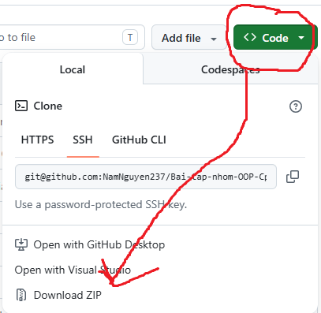
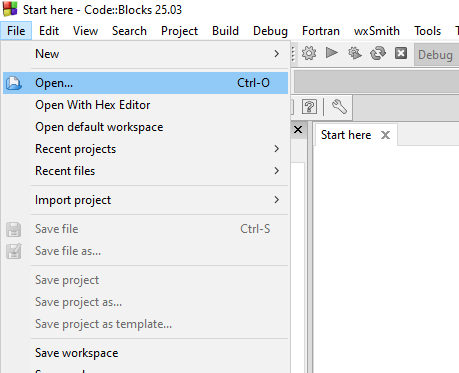
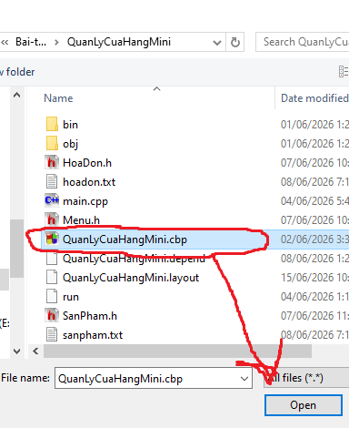

# Bai-tap-nhom-OOP-Cpp

## Bài tập nhóm LTHĐT (OOP) C++ 

### Lớp K19A - CNTT&amp;TT HVQLGD - Nhóm 1 - Đề tài: Hệ thống quản lý bán hàng mini

#### Danh sách thành viên:

- Nguyễn Hồng Nam [GitHub @NamNguyen237](https://github.com/NamNguyen237/)
- Nguyễn Minh Đức [GitHub @remchan725-code](https://github.com/remchan725-code)
- Nguyễn Văn Huy [GitHub @nguyenvanhuy23072007-cmyk](https://github.com/nguyenvanhuy23072007-cmyk)

#### Giới thiệu:

Đây là Kho lưu trữ GitHub (GitHub Repository - viết tắt là GitHub Repo) về Bài tập lớn môn Lập trình Hướng đối tượng C++ của Nhóm 1. Repo này bao gồm Mã nguồn (source code) của dự án (project), file Báo cáo bản mềm (Word + PDF), mã UML diagram kèm diagram đã chuyển sang dạng ảnh, và ảnh minh họa một vài tính năng trong phần mềm.

#### Cài đặt và Chạy:

Project được viết bằng ngôn ngữ lập trình C++ trên IDE Code::Blocks, toàn bộ Project Code::Blocks nằm trong thư mục QuanLyCuaHangMini, mọi file trong đó là cần thiết để project không bị hỏng. Thầy/Cô tiến hành tải toàn bộ Repo về, khi này toàn bộ Repo được tải về trong 1 file .zip. Thầy/Cô giải nén ra và Open file Project trong Code::Blocks. Khi này toàn bộ dự án và mã nguồn sẽ có trong Code::Blocks để tiến hành xem xét và kiểm nghiệm ạ.

