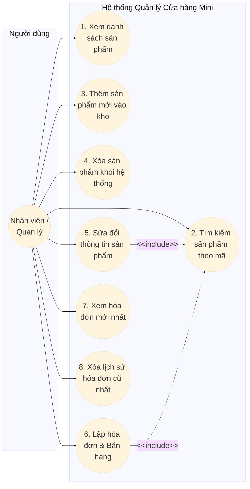

```mermaid

%%{init: { 'theme': 'base', 'themeVariables': { 'fontSize': '30px' } } }%%
flowchart LR
 subgraph subGraph0["Người dùng"]
        Staff(("Nhân viên /<br>Quản lý"))
  end
 subgraph subGraph1["Hệ thống Quản lý Cửa hàng Mini"]
        UC1(("1. Xem danh sách sản phẩm"))
        UC2(("2. Tìm kiếm sản phẩm theo mã"))
        UC3(("3. Thêm sản phẩm mới vào kho"))
        UC4(("4. Xóa sản phẩm khỏi hệ thống"))
        UC5(("5. Sửa đổi thông tin sản phẩm"))
        UC6(("6. Lập hóa đơn & Bán hàng"))
        UC7(("7. Xem hóa đơn mới nhất"))
        UC8(("8. Xóa lịch sử hóa đơn cũ nhất"))
  end
    Staff --> UC1 & UC2 & UC3 & UC4 & UC5 & UC6 & UC7 & UC8
    UC5 -. &lt;&lt;include&gt;&gt; .-> UC2
    UC6 -. &lt;&lt;include&gt;&gt; .-> UC2

```